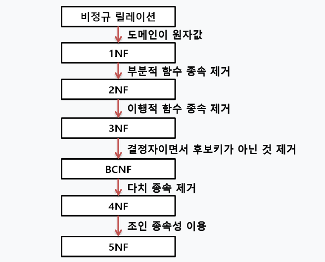
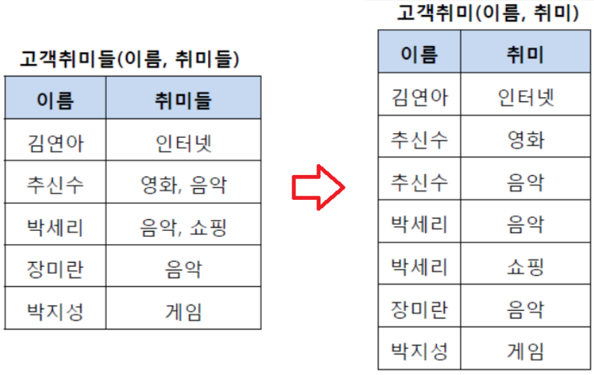
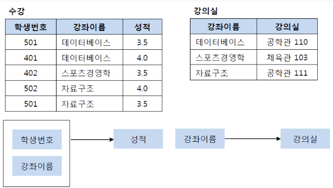
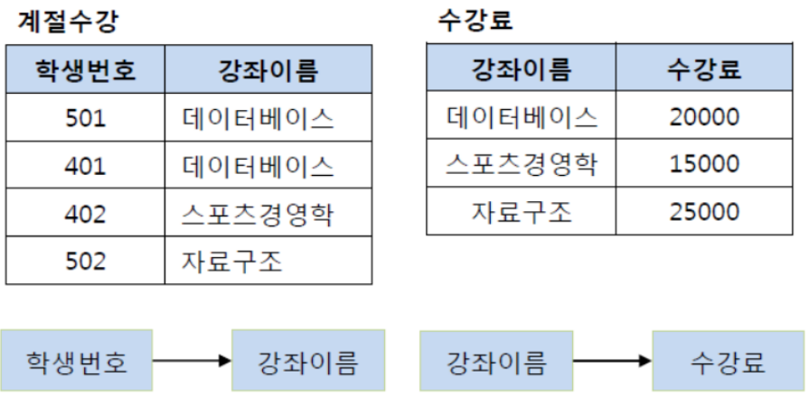

# [데이터베이스 정규화](https://velog.io/@rlrhs11/DB%EB%8D%B0%EC%9D%B4%ED%84%B0%EB%B2%A0%EC%9D%B4%EC%8A%A4%EC%9D%98-%EC%A0%95%EA%B7%9C%ED%99%94%EB%9E%80)
데이터 베이스 설계에서 데이터의 중복을 최소화하게 데이터를 구조화 하는 프로세스를 정규화 라고 하는데 정규화의 목표는이상이 있는 관계를 재구성해서 작고 잘 조직된 관계를 생성하는 것

## 정규화 목적 
- 불필요한 데이터를 제거하고, 데이터의 중복을 최소화 함으로 써 저장공간이나, 자원을 효율적으로 사용하기 위함
- 삽입/갱신/삭제 시 발생할 수 있는 이상 현상을 방지하기 위함
---
## 정규화 과정 
- 아래와 같이 진행되며 보통 1NF ~ 3NF까지 진행하거나 BCNF단계까지 진행

---
### 제1정규형
- 제1 정규화란 테이블의 컬럼이 원자값(Atomic Value, 하나의 값)을 갖도록 테이블을 분해하는 것이다.

---
### 제2정규형
- 제2 정규화란 제1 정규화를 진행한 테이블에 대해 완전 함수 종속을 만족하도록 테이블을 분해하는 것이다.    
- 여기서 완전 함수 종속이라는 것은 기본키의 부분집합이 결정자가 되어선 안된다는 것을 의미한다.

---
- 이 테이블에서 기본키는 (학생번호, 강좌이름)으로 복합키이다. 그리고 (학생번호, 강좌이름)인 기본키는 성적을 결정하고 있다. (학생번호, 강좌이름) --> (성적)
- 그런데 여기서 강의실이라는 컬럼은 기본키의 부분집합인 강좌이름에 의해 결정될 수 있다. (강좌이름) --> (강의실)

---
### 제3정규형
- 제3 정규화란 제2 정규화를 진행한 테이블에 대해 이행적 종속을 없애도록 테이블을 분해하는 것이다.     
- 여기서 이행적 종속이라는 것은 A -> B, B -> C가 성립할 때 A -> C가 성립되는 것을 의미한다.
예를 들어 아래와 같은 계절 학기 테이블을 살펴보자.

---
기존의 테이블에서 학생 번호는 강좌 이름을 결정하고 있고, 강좌 이름은 수강료를 결정하고 있다. 그렇기 때문에 이를 (학생 번호, 강좌 이름) 테이블과 (강좌 이름, 수강료) 테이블로 분해해야 한다.

---
### BCNF 정규화
- BCNF 정규화란 제3 정규화를 진행한 테이블에 대해 모든 결정자가 후보키가 되도록 테이블을 분해하는 것이다.

---
- 특강수강 테이블에서 기본키는 (학생번호, 특강이름)이다. 그리고 기본키 (학생번호, 특강이름)는 교수를 결정하고 있다.
- 또한 여기서 교수는 특강이름을 결정하고 있다.
- 그런데 문제는 교수가 특강이름을 결정하는 결정자이지만, 후보키가 아니라는 점이다.

그렇기 때문에 BCNF 정규화를 만족시키기 위해서 위의 테이블을 분해해야 하는데, 다음과 같이 특강신청 테이블과 특강교수 테이블로 분해할 수 있다.

